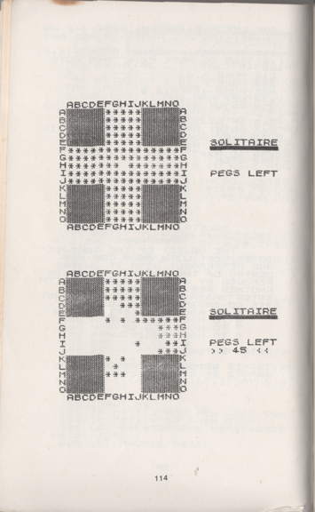

# Soliterm
## A game of peg solitaire to play in the terminal
Soliterm is a game of [Peg Solitaire](https://en.wikipedia.org/wiki/Peg_solitaire) - also known as Solo Noble - that runs in the terminal and developed in Python.
The objective of Soliterm is to empty the game board, except for a single peg in the central hole and using only valid moves.
A peg may move orthogonally over an adjacent peg into a hole two positions away - the peg that has just been 'jumped' over is then removed.

This implementation was inspired by the one in 'The Turing Criterion - Machine Intelligent Programes for the 16K ZX81' (Charlton, Harrison, Jones and Hartnell, 1982), and has 124 holes as opposed to 33 in the traditional English version.

    
    

## Table of contents
*To complete*

## Objectives
The objectives of the application are:

1. To provide the user with an entertaining game of Solitaire in a terminal environment.
2. To provide clear instructions to the user.
3. To present a clear representation of a Peg Solitaire board in a terminal.
4. To successfully validate the user's entry of their next intended move, and provide feedback if the user enters a move in an invalid format or if the desired move is not possible within the rules of the game.
5. To provide the user with feedback on how many pegs they have left in the board.
6. To provide the user with feedback on how many moves they have made.
7. To inform the user if there are no valid moves left.

## Features
*To complete*

### Existing features
*To complete*

### Future features
*To complete*

## Libraries used
- The Python [curses](https://docs.python.org/3/library/curses.html#module-curses) module was used to access the C ncurses library directly using Python. This allows more advanced manipulation of the text displayed in the terminal than would otherwise be possible. The aim was to provide the player with a static game board, and to consistently position the data on the number of pegs left, the number of moves made and the area where the player is prompted for their input in the terminal window. Without using a library such as ncurses, the terminal would quickly fill with text, which would scroll off the screen, and the game board would have to be continually redrawn at the current cursor position. Soliterm also takes advantaged of the fact that ncurses also allows the use of basic colour where supported by the terminal.
- The [NumPy](https://www.w3schools.com/python/numpy/default.asp) library is used for the array representing the game board. This was chosen because NumPy arrays are usually quicker than standard Python lists, and allows simple creation and manipulation of a 2D array, which is a convenient data structure for representing the Solitare board.

## Data model
*To complete*

- Game board data model
- TermManager class

## Testing
*To complete*

### Validator testing
*To complete*

### Bugs
#### Resolved bugs
*To complete*

#### Unresolved bugs
*To complete*

## Deployment
*To complete*

## Credits
### Code
*To complete*
- The deployment terminal was provided by Code Institute.

### Content
*To complete*