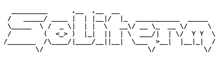
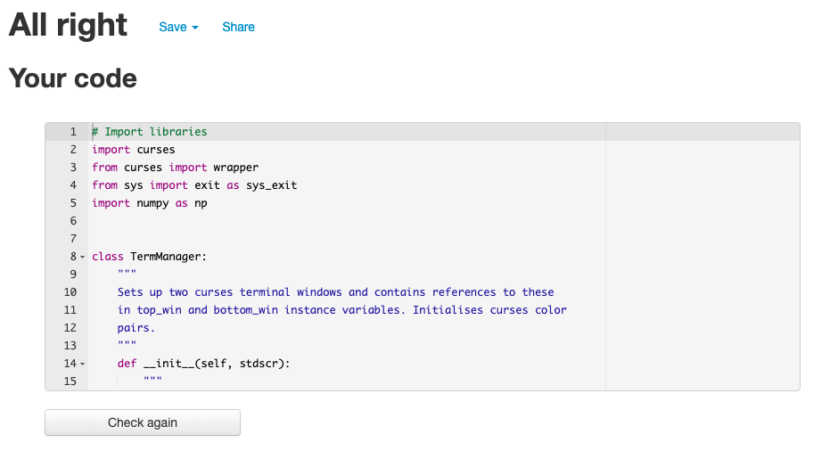

# Soliterm
<p align="center">
    
</p>

## A game of peg solitaire to play in the terminal
Soliterm is a game of [Peg Solitaire](https://en.wikipedia.org/wiki/Peg_solitaire) - also known as Solo Noble - that runs in the terminal and developed in Python.
A real game of Solitaire takes place using a board with holes containing pegs:

<p align="center">
    
</p>

The objective of Peg Solitaire is to empty the game board, except for leaving a single peg in the central hole and using only valid moves.
A peg can only move vertically or horizontally (but not diagonally) by 'jumping' over an adjacent peg into a hole two positions away - the peg that has just been 'jumped' over is then removed. Pegs cannot move directly into a space next to them.

This implementation was inspired by the one in 'The Turing Criterion - Machine Intelligent Programes for the 16K ZX81' (Charlton, Harrison, Jones and Hartnell, 1982), and has 124 holes as opposed to 33 in the traditional English version.

<p align="center">
    
    
</p>

## Table of contents
- [Objectives](#objectives)
- [Features](#features)
    - [Existing Features](#existing-features)
        - [Title screen and instructions](#title-screen-and-instructions)
        - [Peg Solitaire Board](#peg-solitaire-board)
        - [Game Statistics](#game-statistics)
        - [Input Prompt](#input-prompt)
        - [Input Validation and Responses](#input-validation-and-responses)
        - [End of Game Messages](#end-of-game-messages)
    - [Future Features](#future-features)
- [Planning](#planning)
- [Libraries used](#libraries-used)
- [Data Model](#data-model)
    - [GameBoard Class](#gameboard-class)
- [Testing](#testing)
    - [Method](#method)
    - [Validator Testing](#validator-testing)
    - [Bugs](#bugs)
        - [Resolved Bugs](#resolved-bugs)
        - [Unresolved Bugs](#unresolved-bugs)
- [Deployment](#deployment)
- [Credits](#credits)
    - [Code](#code)
    - [Content](#content)


## Objectives
The objectives of the application are:

1. To provide the user with an entertaining game of Solitaire in a terminal environment.
2. To provide clear instructions to the user.
3. To present a clear representation of a Peg Solitaire board in a terminal.
4. To successfully validate the user's entry of their next intended move, and provide feedback if the user enters a move in an invalid format or if the desired move is not possible within the rules of the game.
5. To provide the user with feedback on how many pegs they have left in the board.
6. To provide the user with feedback on how many moves they have made.
7. To inform the user if there are no valid moves left.

## Features
### Existing features
#### Title screen and instructions
Soliterm features a title screen with an ASCII art logo, a 'tagline' to provide a succint explanation of the purpose of the application, and instructions on how to play.
The player can view the instructions again at any time during the game.

The title screen and instructions support objectives 1 and 2.

<p align="center">
    
</p>

#### Peg Solitaire Board
The game screen features a virtual representation of a Peg Solitare board, with pegs represented by `*` and empty holes represented by a blue space. Columns are labelled with letters, and rows with numbers.

The representation of the solitaire board supports objectives 1 and 3.

<p align="center">
    
</p>

#### Game Statistics
The game screen displays the number of pegs currently left in the board and number of turns taken. While there are no limits on the number of turns allowed, players might enjoy trying to complete the game in as few moves as possible. The number of pegs left is useful for the player to understand how close they have managed to get to successfully completing the game.

The game statistics support objectives 1, 5 and 6.

<p align="center">
    
</p>

#### Input prompt
The player is presented with a clear prompt to enter the next move, including an example of the correct format and information on how to quit or view the instructions again.
The original objectives did not require providing the quit and view instructions options, however they were added after testing revealed that both would be helpful additions.

The input prompt supports objectives 1 and 2.

<p align="center">
    
</p>

#### Input validation and responses
The player's input is validated for both its format and whether the desired move is valid within the rules of the game. The player is presented with a clear prompt to try again in the event that either type of validation fails.

The input validation and responses support objectives 1, 2 and 4.

<p align="center">
    
    
</p>

#### End of game messages
For each turn entered by the player, the game checks whether there are any further possible moves left. When the player has run out of moves, the game checks whether the player has won by ending up with one remaining peg in the centre hole. A 'game over' or 'well done' message is displayed, as appropriate.

The end of game messages support objective 7.

<p align="center">
    
    
</p>


### Future features
All originally planned features were successfully implemented. 

An additional feature that could be added would be a choice of difficulty level. The 124 hole version of Peg Solitaire is quite challenging, so adding an easier option with a game board based on a traditional 33 hole layout might make the game more approachable. This could be accomplished by offering the player a choice at the start of the game, and initialising the 2D array used to represent the game board according to the response. The `draw_board()` function - which is responsible for drawing the board on the screen - may need to be configured differently to display a smaller board, for example by allocating more horizontal and vertical spaces to each hole so that the less challenging board does not appear too small.

## Planning
Once the initial idea was conceived, the first work undertaken was an initial experiment with the curses library to evaluate its capabilities and ease of use. This consisted of defining two terminal windows and displaying some simple coloured text in each window within the `main()` function of the `run.py` file. Having confirmed curses would be suitable, the project objectives and a <a href="readme_assets/soliterm_flow.pdf" target ="_blank">flow chart</a> to plan the overall logic of the game were drafted.  

The flow chart proved invaluable in mapping out decision points, determining where data would need to be evaluated and in planning the functions that would be required to implement the intended functionality. 

Once coding began, it became apparent that the `eval_moves()` function should be called at the end of the main loop since the player could not have run out of valid moves at the start of the game. A decision was then taken to define a `GameBoard` class to represent the game board - the `update_stats()` function is implemented as a method within that class, although this does not affect the logic of the flow chart. The functionality of the `board.update()` method depicted on the flow chart was implemented within the `main()` function until a late stage of development - this was due to an oversight, and once realised the opportunity was then taken to simplify `main()` by implementing an `update_board()` method on the `GameBoard` class.

## Libraries used
- The Python [curses](https://docs.python.org/3/library/curses.html#module-curses) module was used to access the C ncurses library directly using Python. This allows more advanced manipulation of the text displayed in the terminal than would otherwise be possible. The aim was to provide the player with a clear view of the game board, and to consistently position the data on the number of pegs left, the number of moves made and the area where the player is prompted for their input in the terminal window. Without using a library such as ncurses, the terminal would quickly fill with text, which would scroll off the screen, and the game board would have to be repeatedly redrawn at the current cursor position, as the previous iteration scrolled up the screen. Soliterm also takes advantage of the fact that ncurses allows the use of basic colour where supported by the terminal.
- The [NumPy](https://www.w3schools.com/python/numpy/default.asp) library is used for the array representing the game board. Standard Python lists would have been sufficient, however NumPy was chosen because its arrays are usually quicker than standard Python lists, and it allows simple creation and manipulation of a 2D array, which is a convenient data structure for representing the Solitaire board.
- The `exit()` function from the `sys` library was used to ensure a clean exit in the event the player chooses to quit from within the game.

## Data model
### GameBoard class
A GameBoard class is defined to represent the board. This contains an instance variable with a two dimensional NumPy array, consisting of an outer array populated with a number of further arrays, one for each row of the board. The values within the arrays are:
- 0 = an empty hole
- 1 = a hole containing a peg
- 2 = an unplayable 'space' at the edge of the board


    The starting layout of the array looks like this:

```
            [
                [2, 2, 2, 2, 2, 1, 1, 1, 1, 1, 2, 2, 2, 2, 2],
                [2, 2, 2, 2, 2, 1, 1, 1, 1, 1, 2, 2, 2, 2, 2],
                [2, 2, 2, 2, 2, 1, 1, 1, 1, 1, 2, 2, 2, 2, 2],
                [2, 2, 2, 2, 2, 1, 1, 1, 1, 1, 2, 2, 2, 2, 2],
                [2, 2, 2, 2, 2, 1, 1, 1, 1, 1, 2, 2, 2, 2, 2],
                [1, 1, 1, 1, 1, 1, 1, 1, 1, 1, 1, 1, 1, 1, 1],
                [1, 1, 1, 1, 1, 1, 1, 1, 1, 1, 1, 1, 1, 1, 1],
                [1, 1, 1, 1, 1, 1, 1, 0, 1, 1, 1, 1, 1, 1, 1],
                [1, 1, 1, 1, 1, 1, 1, 1, 1, 1, 1, 1, 1, 1, 1],
                [1, 1, 1, 1, 1, 1, 1, 1, 1, 1, 1, 1, 1, 1, 1],
                [2, 2, 2, 2, 2, 1, 1, 1, 1, 1, 2, 2, 2, 2, 2],
                [2, 2, 2, 2, 2, 1, 1, 1, 1, 1, 2, 2, 2, 2, 2],
                [2, 2, 2, 2, 2, 1, 1, 1, 1, 1, 2, 2, 2, 2, 2],
                [2, 2, 2, 2, 2, 1, 1, 1, 1, 1, 2, 2, 2, 2, 2],
                [2, 2, 2, 2, 2, 1, 1, 1, 1, 1, 2, 2, 2, 2, 2]
            ]
```

The GameBoard class also contains instance variables representing the number of pegs left on the board and the number of turns the player has had. These are used to populate the statistics displayed in the game.

An instance of the GameBoard class is created at the start of the game, and updated each time the player makes a valid move.
A separate `draw_board()` function handles drawing the board to the terminal screen. This is called each time the layout of the pegs within the GameBoard object changes. `draw_board()` translates the values in the 2D array to a series of characters on the screen - a `*` for a value of 1, a space with a blue background for a value of 0 and a space with a black background for a 2. In fact, each 'cell' of the game board is given three spaces on the terminal, so that the board does not look too small.

## Testing
### Method

Testing of Soliterm was particularly challenging, given the large number of possible board configurations, valid moves and end game conditions.
It was apparent that a range of different states needed to be tested to detect as many bugs as possible, so the following approach was adopted:

- While developing the `validate_format()` function, which is responsible for both validating the format of the player's input and returning the coordinates and direction of any valid move, a test function called `debug_output_move()` was used to output a string containing the outcome of the validation (`True` or `False`), row, column and direction of the player's move to the terminal. This function was removed once the `validate_format()` had been completed and confirmed to work correctly.
- To enable testing of the `validate_move()` function, the starting configuration of the array representing the game board was temporarily amended to contain lots of empty cells, to quickly test the output of the function in different scenarios. When play testing revealed bugs in the `validate_move()` and `eval_moves()` functions, screenshots of the state of the board when the bugs occurred were taken. The data for the fully initialised layout of the board was commented out and replaced by a layout manually amended to match the screenshots to enable repeated testing of the state of the board when the bugs were detected. This is an example of a problematic layout where `eval_moves()` was erroneously finding valid moves where there were none:
<p align="center">
    
</p>

- Further board layouts for testing of specific functions were used, notably for the `eval_moves()` function which tests whether there are any valid moves left and the `check_win()` function which tests whether the player has 'won'. These were copied and pasted out into a [`debug.py`](readme_assets/debug.md) file (further detail below) so that they could be swapped in and out of the `run.py` file for testing different scenarios. Note this file is not included in the GitHub repo, but the code is provided in a markdown file to illustrate the approach.
- While use of the curses library allows considerable flexibility in formatting output to the terminal, the output of `print` statements is disabled, complicating the debugging process. This was particularly challenging when debugging the `eval_moves()` function, because it was necessary to examine exactly which cells were being tested and the outcomes. Use of the Python [logging](https://docs.python.org/3/library/logging.html) API to output values to a log file was considered, however a simple approach was chosen. The `GameBoard` class and the `eval_moves()` functions were copied into a [`debug.py`](readme_assets/debug.md) file which didn't use curses, allowing a game board to be initialised and the output of print statements within the `eval_moves()` function to be printed to the terminal. This enabled the bug to be identified and fixed quite quickly.

### Validator testing
The PyLint linter within the GitPod development environment detected numerous issues within the Python code such as trailing whitespace, insufficient or excessive gaps between function blocks, excessive gaps between lines of code, lines over 80 characters and unnecessary `else`/`elif` statements. 

PyLint also stated that there were too many return statements in the `validate_format()` function (8 where the threshold for a warning is 6). Some refactoring took place to reduce these, but at the expense of a larger number of and more complex `if` statements, triggering another PyLint warning about too many branches. The previous version with the greater number of return statements was deemed to be easier to understand and more robust, so this refactoring was undone and the warning noted. 

PyLint states that the `TermManager` class which is used to hold references to the curses terminal and to perform some set-up of curses has 'too few public methods'. This suggests that a different data structure such as a dictionary might be more appropriate, however because `TermManager` performs some logic (e.g. initialising curses 'color pairs', displaying in game messages in the bottom terminal window) it was decided to retain this class.

The code has now been checked using the [PEP8 online](http://pep8online.com/) linter, and no issues were found.

<p align="center">
    
</p>

### Bugs
#### Resolved bugs
- The `curses getstr()` function which is used to prompt and accept input from the player was returning a bytes object instead of a string, which caused a type error in the `validate_format()` function. This validation error was resolved with the help of a [Stack Overflow](https://stackoverflow.com/questions/21505871/curses-window-getstr) question, which noted that the `decode` method needs to be used to convert the input to a string in Python 3.
- The `validate_format()` function was incorrectly parsing the row number and returning only the first digit, e.g. 'a35d' would be returned as row 0, column 3, down (should be column 34 as rows and columns are zero indexed). This validation error was caused by incorrect use of the Python string slicing syntax - the range for the slice was specified as 1:2, but should have been 1:3 so as to include the third character of the string.
- The `validate_move()` function tests the player's move to check whether it is valid according to the rules of the game, and returns information about all the cells that are affected by the move. If the player tried to move a piece off the edge of the board this could lead to the function trying to access an index outside the bounds of the game_board array. This caused an `IndexError` exception, and the programme to crash. `try`/`except` blocks were added to catch these errors and treat them as any other invalid move. While this fixed that particular bug, the fix for a further bug detailed below eliminated the possiblity of causing an `IndexError` exception and made these `try`/`except` blocks superfluous, so they were eventually removed.
- The `eval_moves()` function tests whether there are any valid moves left on the board, and returns `True` or `False`. A False outcome means there are no moves left, and the game is over. After the function was implemented, the game loop continued even when there were no valid moves left. This was challenging to debug. Although an issue with the `eval_moves()` function erroneously returning `True` was suspected, a bug was found in the `main()` function. `main()` contains a boolean variable called `valid_move` which is initially set to `False`. A `while` loop continues until the player is deemed to have entered a valid move and this flag is set to `True`. The bug was caused by neglecting to set `valid_move` to `True` after a valid turn, causing an infinite loop asking the player to continue to enter their moves even when there were none left.
- However after this was fixed, continued play testing revealed that `eval_moves()` was indeed returning erroneous `True` values in some circumstances. The function was tested in the `debug.py` file as noted above. Examination of the output led to the conclusion that negative array indices were causing the function to reference the end of the  `board_arr` array in the `GameBoard` class. This meant that valid moves were being detected for cells on the edge of the board with certain configurations of cells on the opposite side. This was fixed with some additional nested `if` statements in `eval_moves()`.
- Fixing this bug in `eval_moves()` then led to the realisation that a similar bug existed in `validate_move()`, meaning the player could move to the opposite side of the board in some circumstances. This was fixed by adding an additional condition to the `if` statements in `validate_move()` to ensure a move is only flagged as valid if a suitable distance from the edge of the board. This fix eliminated the need for the `try`/`except` blocks mentioned above.
- The `show_msg()` method of the `TermManger` class accepts an integer representing a row on the terminal and a number of strings, and displays those strings in the bottom window starting at a specified row. This function was created because outputting messages to the bottom window is a frequent action, and the intricacies of using curses resulted in many repetitious lines of code to undertake such actions as positioning the cursor, clearing the line, refreshing the window etc. The first iteration of this method cleared the bottom window before displaying the strings, however in some circumstances this is not desirable - for example, the message for the player to enter a valid move in response to entering an invalid move was not seen by the player, as it was cleared immediately by `show_msg()` displaying the input prompt. `show_msg()` was refactored to only clear each line before a new string is output, and in cases where previous output needs to be overwritten (e.g. for the start screen and the end of game message) additional empty strings are passed to `show_msg()`, ensuring all lines are cleared.

#### Unresolved bugs
All detected bugs have been resolved, although the challenges of testing all possible states of the game board allows the possibility of undetected bugs.

## Deployment
The application has been deployed using the Code Institute 'mock terminal' template for Heroku.
To deploy in Heroku:

- Fork or clone this repository in GitHub
- Log in to Heroku
- Select 'Create new app' from the 'New' menu at the top right
- Enter a name for the app and select the appropriate region
- Select 'Create app'
- Select 'Settings' from the menu at the top
- Find the 'Config Vars' section and select 'Reveal Config Vars'
- Enter `PORT` for the key and `8000` for the value, then select 'Add' to add a new Config Var
- Scroll down to the 'Buildpacks' section
- Select 'Add' and add the `Python' buildpack
- Select 'Add' again and add the 'NodeJS' buildpack (this must be after adding the Python buildpack)
- Select 'Deploy' from the menu at the top
- Select 'GitHub' and confirm you wish to deploy using GitHub. You may be asked to enter your GitHub password
- Find the 'Connect to GitHub' section and use the search box to locate your repo
- Select 'Connect' when found
- Optionally choose the main branch under 'Automatic Deploys' and select 'Enable Automatic Deploys' if you wish your deployed site to be automatically redeployed every time you push changes to GitHub
- Find the 'Manual Deploy' section, choose 'main' as the branch to deploy and select 'Deploy Branch'. 
- Your site will shortly be deployed and you will be given a link to the deployed site when the process is complete.

## Credits
### Code
- The deployment terminal was provided by Code Institute.
- The official [Python documentation](https://docs.python.org/3/howto/curses.html) on the curses library was referenced to understand how to use curses
- Code from [this tutorial](https://www.codingem.com/python-range-of-letters/) from codingem was adapated to create a range of letters
- This [Stack Overflow](https://stackoverflow.com/questions/21505871/curses-window-getstr) question helped to resolve a bug caused by the `getstr()` function returning a value of a type other than a string
- This tutorial from [thispointer.com](https://thispointer.com/count-occurrences-of-a-value-in-numpy-array-in-python/) was referenced to learn how to count the number of occurences of a value in an array

### Content
- Image of wooden peg solitaire board at the top of the read-me is from [Complexity of Games](https://www.isnphard.com/i/peg-solitaire/)
- The read-me contains two scanned pictures of the book 'Machine Intelligent Programmes for the ZX81' (Charlton, Harrison, Jones and Hartnell, 1982)
- The ASCII art Soliterm logo was generated using [patorjk.com](https://patorjk.com/software/taag/#p=display&f=Graffiti&t=Soliterm)